## Uso do Flexbox

### Por que usar Flexbox?

O Flexbox (ou "Flexible Box Layout") é uma tecnologia de layout no CSS que facilita a criação de layouts complexos e
responsivos sem precisar recorrer a posicionamentos flutuantes (floats) ou tabelas. Ele é ideal para distribuir espaço
entre os itens em um contêiner e controlar o alinhamento dos elementos em uma página, mesmo quando o tamanho dos
elementos ou o espaço disponível varia.

## Flexbox do projeto "Doguinhos"

Nesse projeto, buscamos demonstrar as diferentes formas de organização de componentes usando o `justify-content`, 
ilustrando cada exemplo com imagens fofas:

 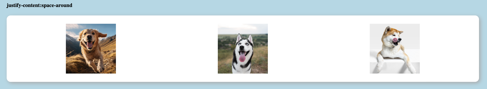
 
- **`justify-content: space-around;`**
   Separa as imagens com o mesmo espaçamento entre elas. No entanto, o espaço nas extremidades (bordas) é metade do espaço entre as imagens.
  
 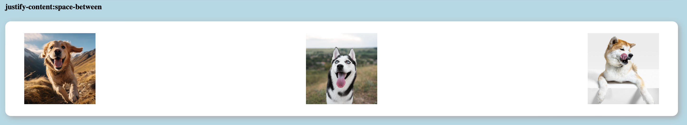
 
- **`justify-content: space-between;`**
    Separa as imagens com o mesmo espaçamento entre elas, mas sem espaç nas bordas. As imagens nas extremidades tocam as bordas do contêiner.

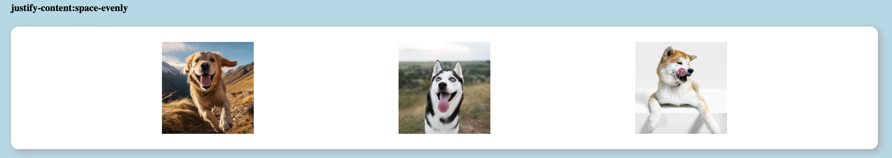

- **`justify-content: space-evenly;`**
    Distribui as imagens com o mesmo espaçamento entre todas elas, incluindo nas bordas.

   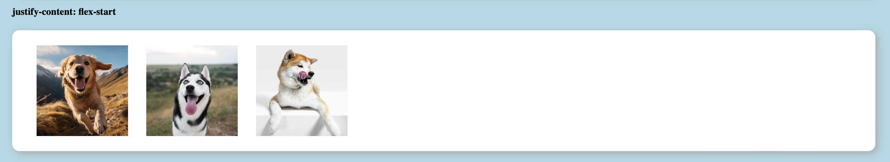

- **`justify-content: flex-start;`**
    Alinha todas as imagens no início (à esquerda, por padrão) do contêiner.

   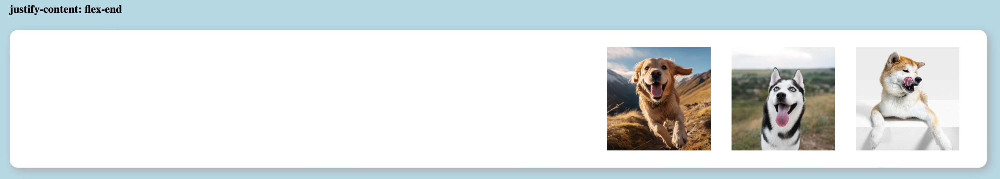

- **`justify-content: flex-end;`**
    Alinha todas as imagens no final (à direita, por padrão) do contêiner.

   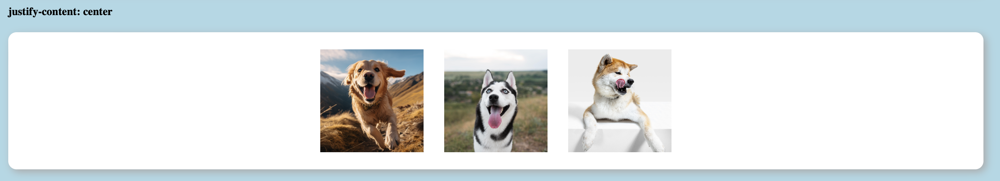

- **`justify-content: center;`**
    Centraliza todas as imagens no meio do contêine.

    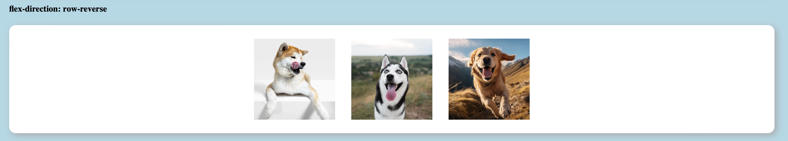

- **`flex-direction: row-reverse;`**
    Inverte a ordem das imagens, exibindo-as na direção oposta

    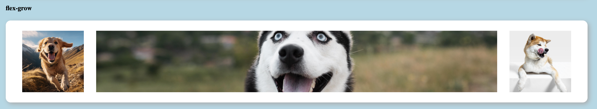

- **`flex-grow;`**
    Permite que a imagem (ou outro item) com `flex-grow` definido cresça para preencher o espaço livre disponível no contêiner.   

## Flexbox do projeto "todo"

Neste projeto, o Flexbox foi utilizado principalmente para organizar os dias da semana e as tarefas associadas,
garantindo que o layout seja flexível e se adapte ao tamanho da tela.
<br/>


### Container principal (.container)

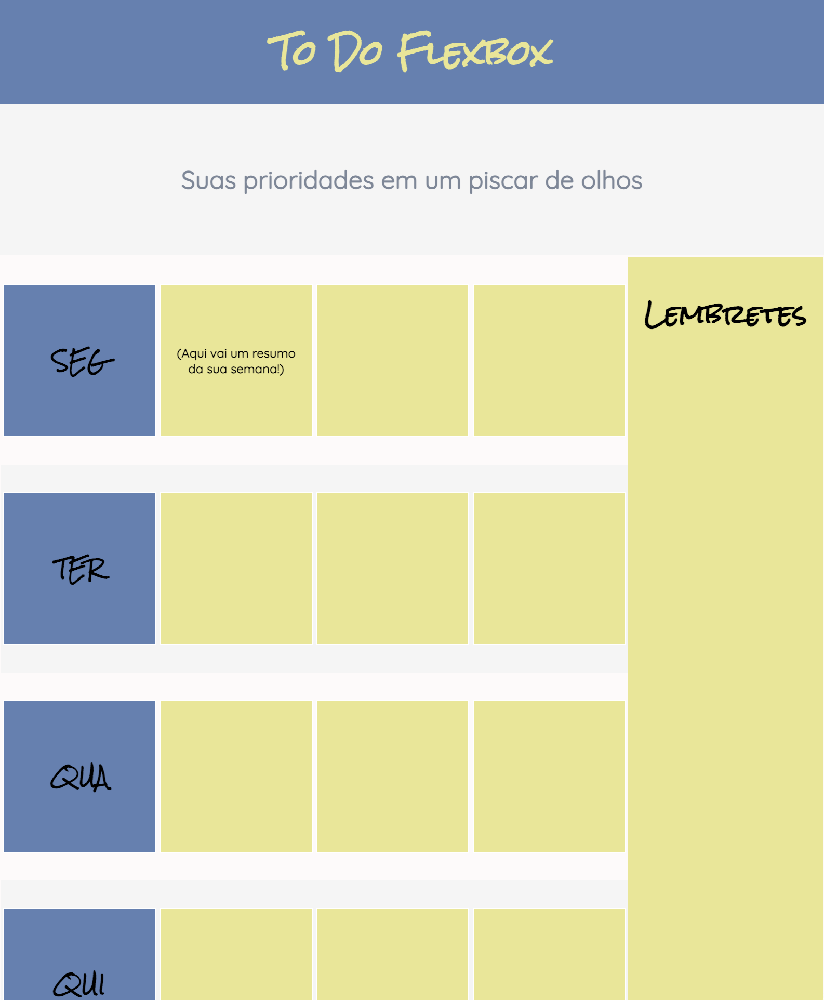

```CSS
.container {
    border: 2px solid snow;
    display: flex;
}
```

- **display: flex;** Este é o ponto de partida para ativar o comportamento flexível dentro do contêiner .container. Com
  isso, todos os elementos filhos desse contêiner serão organizados em um layout flexível, alinhando-se conforme o
  espaço disponível.

### Organização em Colunas (.week)

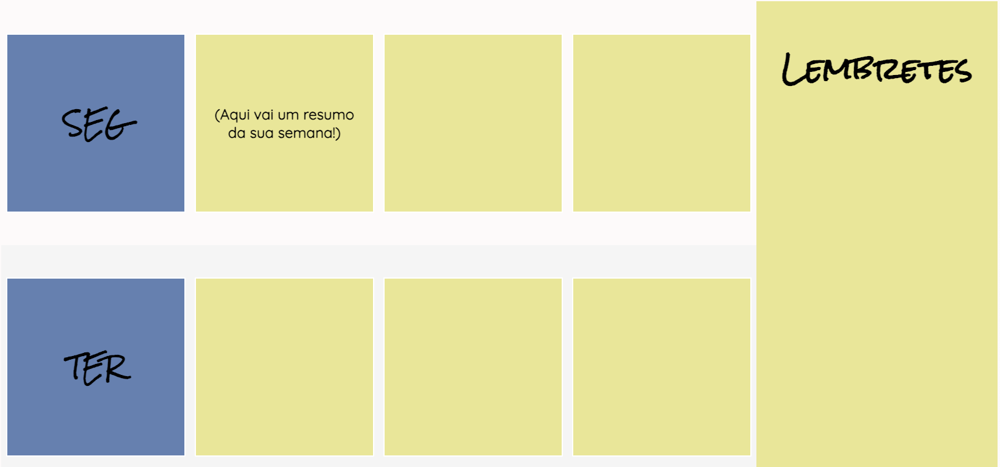

```CSS
.week {
    display: inline-flex;
    flex-grow: 3;
    flex-direction: column;
}
```  

- **flex-direction: column;** Define que os itens dentro do contêiner .week serão dispostos em uma coluna. Isso
  significa que os dias da semana (e suas tarefas) serão organizados verticalmente, de cima para baixo.
- **flex-grow: 3;** Permite que o contêiner .week cresça proporcionalmente para ocupar mais espaço, se necessário. Neste
  caso, ele é definido para ocupar três vezes mais espaço comparado ao outro contêiner ao lado (o de lembretes).

### Distribuição dos Itens (.row)

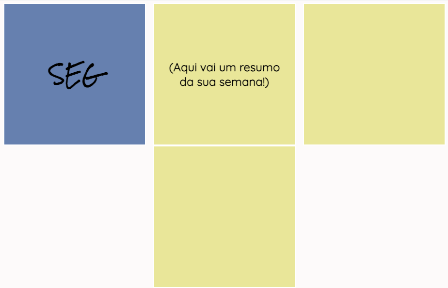

```CSS
.row {
    min-height: 200px;
    display: flex;
    flex-wrap: wrap;
    justify-content: space-around;
    align-items: center;
}
```

- **display: flex;** Ativa o Flexbox para o contêiner .row, onde cada linha representa um dia da semana com suas
  respectivas tarefas.
- **flex-wrap: wrap;** Permite que os itens se movam para a próxima linha se o espaço horizontal não for suficiente, o
  que é útil em layouts responsivos.
- **justify-content** space-around;: Distribui os itens igualmente com espaços ao redor deles, garantindo que haja um
  espaço uniforme entre os dias e as tarefas, além de margens externas consistentes
- **align-items** center;: Alinha verticalmente os itens no centro do contêiner .row, garantindo que todos os elementos
  estejam centrados na linha.

  ## Vantagens de Usar Flexbox
- **Flexibilidade**: Permite criar layouts que se ajustam automaticamente a diferentes tamanhos de tela e mudanças
  dinâmicas no conteúdo.
- **Simplicidade**: Reduz a complexidade do código CSS, eliminando a necessidade de hacks ou cálculos manuais para
  alinhar elementos.
- **Responsividade**: Facilita a criação de layouts que funcionam bem em dispositivos móveis, tablets e desktops sem a
  necessidade de media queries complexas.

## Uso de Flexbox com Tailwind CSS

### Por que usar Tailwind CSS e Flexbox?

Tailwind CSS é um framework de CSS utilitário que permite construir interfaces de usuário diretamente no HTML,
utilizando classes prontas. Isso reduz a necessidade de escrever CSS personalizado, acelerando o desenvolvimento e
garantindo consistência. Com Tailwind, o Flexbox se torna ainda mais fácil de aplicar e gerenciar, permitindo uma
organização flexível e responsiva dos elementos na página.


## Neste projeto, o design utilizado como base foi esse:


## Estrutura Flexbox no Projeto **Tea Cozy Coffee**

Neste projeto, o Flexbox foi utilizado principalmente para organizar o layout do cabeçalho, seções principais e rodapé,
garantindo que todos os elementos se alinhem corretamente e que o layout seja responsivo.
<br/>


### Cabeçalho Flexível

No cabeçalho, usamos o Flexbox para organizar o logotipo e o menu de navegação. Isso garante que os elementos se alinhem
horizontalmente e ocupem o espaço disponível de forma equilibrada.


```html

<header class="bg-slate-900 px-3 h-16 fixed flex justify-between w-full border-b border-zinc-400 items-center z-50">
  
  <nav>
    <ul class="flex gap-3 self-end underline text-xl">
      <li>Missão</li>
      <li>Chá em destaque</li>
      <li>Localizações</li>
    </ul>
  </nav>
</header>
```

- **flex**: A classe flex ativa o Flexbox no contêiner, permitindo que os itens internos (logotipo e navegação) se
  alinhem horizontalmente.
- **justify-between**: Esta classe distribui os itens dentro do contêiner com o máximo de espaço possível entre eles,
  colocando o logotipo à esquerda e o menu à direita.
- **items-center**: Alinha verticalmente os itens no centro do contêiner, garantindo que o logotipo e o menu fiquem
  alinhados horizontalmente.

### Seção Principal

As seções do corpo principal utilizam Flexbox para alinhar o conteúdo centralizado e organizar os itens em colunas e
linhas, dependendo da necessidade.

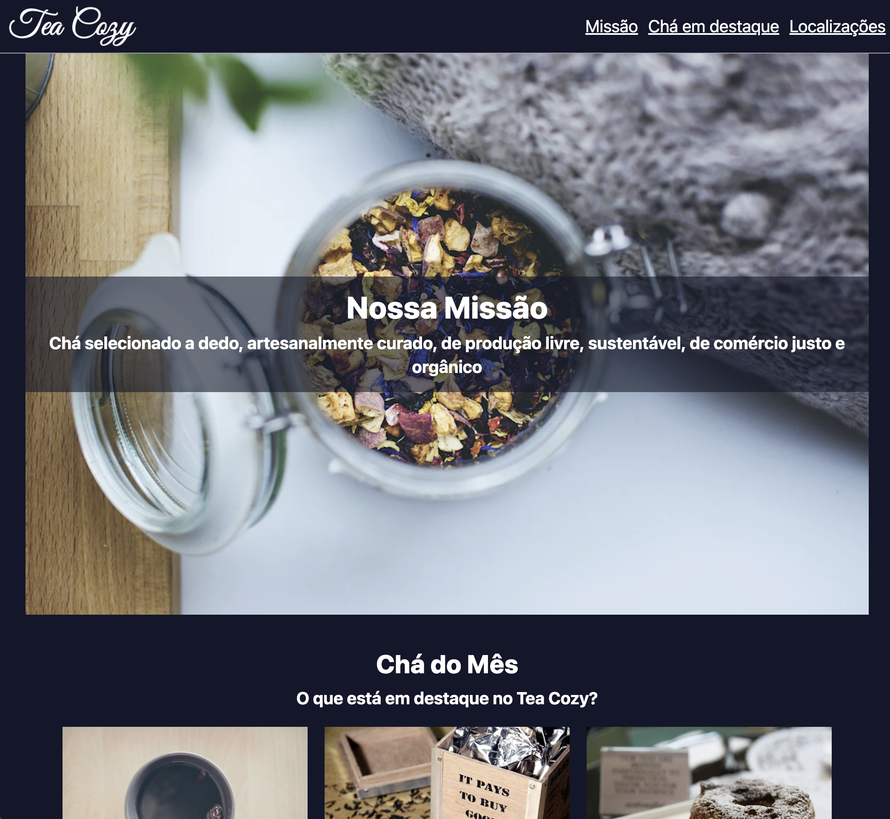

```html

<main class="pt-16 mx-8">
  <section class="relative">
    
    <article class="absolute inset-0 flex flex-col items-center justify-center">
      <div class="bg-slate-900 bg-opacity-60 p-4 text-center">
        <h2 class="font-extrabold text-4xl mb-2">Nossa Missão</h2>
        <h4 class="font-bold text-xl">Chá selecionado a dedo...</h4>
      </div>
    </article>
  </section>
</main>
```

- **flex-col**: A classe flex-col organiza os itens verticalmente dentro do contêiner, o que é útil para alinhar o
  conteúdo de forma que ele fique centralizado verticalmente.
- **items-center**: Alinha o conteúdo no centro horizontalmente, garantindo uma aparência equilibrada.

### Organização de Itens em Grid com Flexbox

Os produtos em destaque são organizados em uma grid utilizando Flexbox, garantindo que cada item seja centralizado e
espaçado uniformemente.

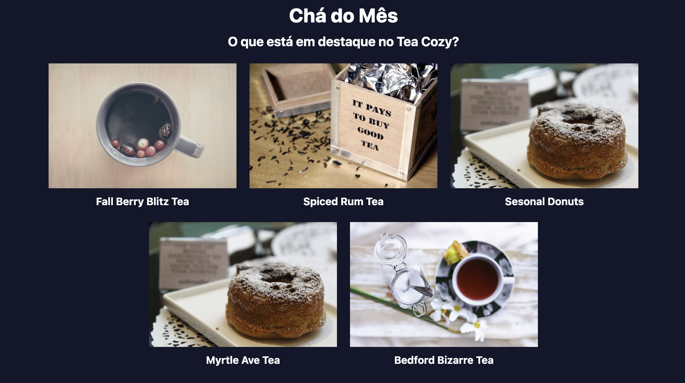

```html

<article class="flex gap-5 flex-wrap justify-center w-full">
  <div class="flex flex-col items-center font-bold gap-2">
    
    <p>Fall Berry Blitz Tea</p>
  </div>
  <!-- Mais itens... -->
</article>
```

- **flex-wrap**: Permite que os itens sejam dispostos em várias linhas, se necessário, ajustando-se ao tamanho da tela.
- **justify-center**: Centraliza os itens dentro do contêiner, garantindo que todos os produtos sejam exibidos de forma
  organizada.
  **gap-5**: Adiciona espaço entre os itens, proporcionando uma separação visual clara e agradável.

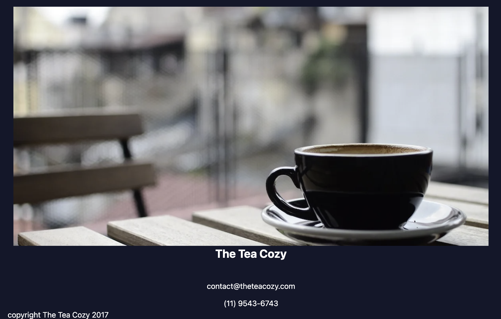

### Vantagens de Usar Tailwind com Flexbox

- **Rapidez no Desenvolvimento**: As classes utilitárias de Tailwind permitem construir layouts complexos rapidamente,
  sem escrever muito CSS personalizado.
- **Consistência Visual**: As classes padronizadas garantem uma consistência visual em todo o projeto.
- **Flexibilidade e Responsividade**: Combinando Flexbox e Tailwind, é fácil criar layouts que funcionam bem em qualquer
  dispositivo, seja móvel ou desktop.
